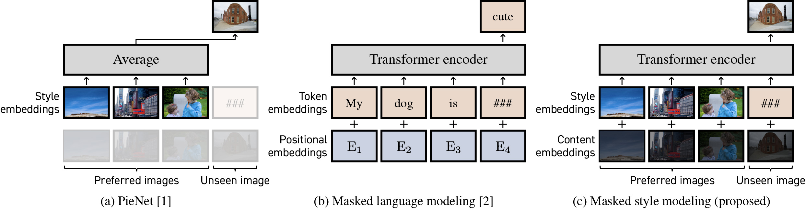

# Personalized Image Enhancement Featuring Masked Style Modeling

<p align="left">

</p>

## Requirements
- Python3.7.5

To install the Python libraries,
```Shell
pip install --upgrade pip
pip install -r requirements.txt
```

## Training
Start the first training step.
```Shell
python train1.py
```
Start the second training step.
```Shell
python train2.py
```

## Test
Test our model.
```Shell
python test.py
```
To test our model with the pretrained models, please download the pretrained models from [here](https://www.hal.t.u-tokyo.ac.jp/~kosugi/masked-style-modeling/pretrained_models.tar.gz).
```Shell
python test.py --save_dir pretrained_models
```

## Reference
Our implementation is based on [StarEnhancer](https://github.com/IDKiro/StarEnhancer). We would like to thank them.
